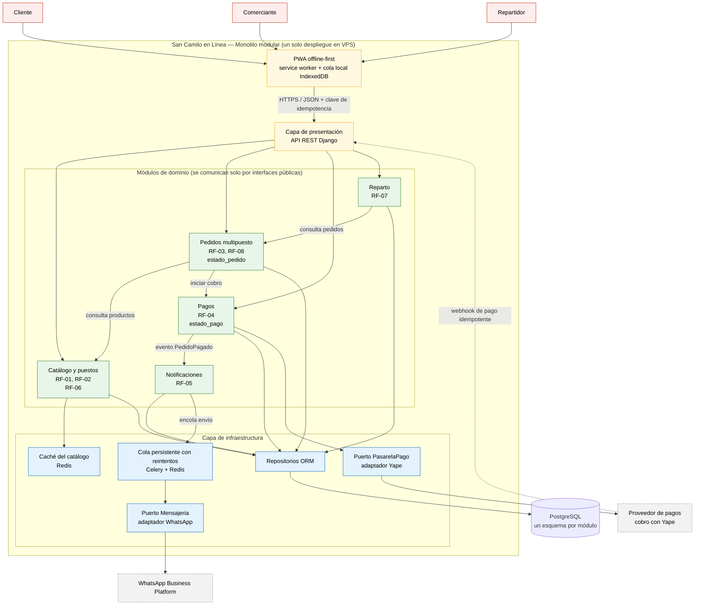

# San Camilo en Línea — Laboratorio 04: Fundamentos de arquitectura de software

Construcción de Software · EPIS-UNSA · 2026-B · Grupo B

## Integrantes

| Nombre | Rol en el laboratorio | Entregables |
|--------|-----------------------|-------------|
| Jhonatan Benjamin Mamani Céspedes | Analista de drivers, responsable de la matriz de decisión, diagramador (Mermaid) y redactor de ADR | E1, E2, E3, E4 |
| Jafet Martin Llave Aguilar | Diagramador (PlantUML y Python Diagrams), verificador de IA y responsable del README | E5, E6, E7, E8 |

## Caso

**San Camilo en Línea** permite a los clientes pedir productos a varios puestos del Mercado San
Camilo (Arequipa) en un solo pedido, con recojo o delivery. El pago se realiza con Yape mediante
un proveedor de pagos, y cada comerciante recibe la confirmación por WhatsApp. Los actores son
el cliente, el comerciante y el repartidor. El MVP debe estar en producción en 1 mes, con
2 developers (Python/Django) y un solo VPS de bajo costo.

**Atributo de calidad crítico:** capacidad de interacción. Un comerciante con poca experiencia
digital publica un producto en **≤ 3 toques** desde un celular de gama baja con 3G intermitente
(ver [drivers](docs/architecture/drivers.md), QA-01).

## Arquitectura elegida: monolito modular



Resultado de la [matriz de decisión](docs/architecture/matriz-decision.md):
**monolito modular 4,10** · monolito en capas 4,00 · microservicios 2,60.

## Entregables

| Código | Entregable | Archivo |
|--------|------------|---------|
| E1 | Drivers y escenarios de calidad | [drivers.md](docs/architecture/drivers.md) |
| E2 | Alternativas y matriz de decisión | [matriz-decision.md](docs/architecture/matriz-decision.md) |
| E3 | Diagrama de la arquitectura elegida (Mermaid) | [arquitectura.mmd](docs/architecture/diagramas/arquitectura.mmd) · [imagen](docs/architecture/diagramas/img/arquitectura.png) |
| E4 | Registros de decisiones arquitectónicas | [carpeta adr/](docs/architecture/adr/) |
| E5 | Alternativa descartada (PlantUML) | [alternativa.puml](docs/architecture/diagramas/alternativa.puml) · [imagen](docs/architecture/diagramas/img/alternativa.png) |
| E6 | Vista de despliegue (Python Diagrams) | [despliegue.py](docs/architecture/diagramas/despliegue.py) · [imagen](docs/architecture/diagramas/img/despliegue.png) |
| E7 | Bitácora de uso de IA | [bitacora-ia.md](docs/architecture/bitacora-ia.md) |

## Decisiones arquitectónicas

- [ADR-001: Monolito modular en Django](docs/architecture/adr/001-estilo-arquitectonico.md)
- [ADR-002: PostgreSQL con un esquema por módulo](docs/architecture/adr/002-base-de-datos.md)
- [ADR-003: PWA offline-first](docs/architecture/adr/003-estrategia-offline-pwa.md)

## Reflexión sobre el uso de la IA

Consultamos a Gemini, ChatGPT y Claude, y los tres coincidieron en el monolito modular. Ese
acuerdo no reemplazó la verificación: los errores estaban en los detalles.

- **Usabilidad:** Gemini propuso un flujo "de 3 toques" que en un celular real sumó 5.
- **Disponibilidad:** sugirió hilos de Python para las notificaciones, que pierden tareas si el
  servidor se reinicia.
- **Pagos:** planteó validar Yape con una captura de pantalla, que puede falsificarse.
- **Asíncronía:** ChatGPT recomendó postergar las tareas asíncronas, aunque nuestro escenario
  QA-03 ya las exigía.
- **Alcance:** Claude nos advirtió que el equipo era de 2 integrantes y no de 3, y que la guía
  pedía diagramar la segunda mejor alternativa.

Aprendimos a contrastar cada afirmación con nuestros drivers, a hacer cálculos y pruebas propias
en lugar de aceptar cifras plausibles, y a revisar la documentación oficial antes de dar por
cierta una capacidad de un servicio externo. La IA aceleró la redacción y los diagramas, pero
las decisiones y su verificación fueron nuestras.

## Estructura del repositorio

```
cs-2026b-lab04-grupoXX/
├── README.md
└── docs/architecture/
    ├── drivers.md
    ├── matriz-decision.md
    ├── bitacora-ia.md
    ├── anexos/            # respuestas completas de Gemini y ChatGPT
    ├── adr/               # 000-plantilla, 001, 002, 003
    └── diagramas/
        ├── arquitectura.mmd
        ├── alternativa.puml
        ├── despliegue.py
        └── img/           # PNG de E2, E3, E5 y E6
```
