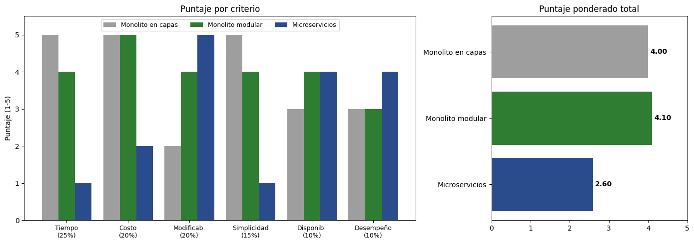

# Matriz de decisión — San Camilo en Línea

## 1. Alternativas

Las alternativas se construyeron a partir de las propuestas de dos asistentes de IA (ver
[bitácora](bitacora-ia.md), entradas 1 a 4) y fueron depuradas por el equipo:

- **Gemini** propuso: monolito modular SSR (Django + HTMX + PWA), arquitectura desacoplada
  (DRF + SPA en React/Vue) y monolito orientado a eventos (Django + Celery/Redis).
- **ChatGPT** propuso: monolito modular, monolito + eventos ligeros y microservicios.

Decidimos no comparar "SPA desacoplada" ni "monolito + eventos" como estilos separados:

- La SPA es una decisión de *frontend* que se resuelve en ADR-003 (PWA).
- Las tareas asíncronas son una táctica que se puede aplicar dentro de un monolito; la
  incorporamos en B para cumplir QA-03.

Para comparar estilos realmente distintos, agregamos el **monolito en capas** como línea base de
máxima simplicidad.

- **A. Monolito en capas:** una sola aplicación Django organizada en presentación → lógica de
  negocio → acceso a datos. Servicios y modelos se comparten entre todas las funcionalidades
  (catálogo, pedidos, pagos, notificaciones y reparto) sobre una sola base de datos.
- **B. Monolito modular:** un solo despliegue Django dividido en 5 módulos de dominio (catálogo,
  pedidos, pagos, notificaciones, reparto) que se comunican solo mediante interfaces públicas.
  Cada módulo tiene su propio esquema en PostgreSQL; las integraciones externas (Yape, WhatsApp)
  van detrás de puertos y adaptadores, y las notificaciones se envían mediante una cola
  persistente con reintentos.
- **C. Microservicios:** cada funcionalidad es un servicio desplegable de forma independiente,
  con su propia base de datos, detrás de un API Gateway y comunicado mediante un broker de
  eventos (RabbitMQ), en contenedores.

## 2. Criterios y pesos (suman 100 %)

| Criterio                            | Peso      | Justificación (driver relacionado)                                                              |
|-------------------------------------|-----------|-------------------------------------------------------------------------------------------------|
| Tiempo de entrega                   | 25 %      | R-01: MVP en producción en 1 mes; R-02: solo 2 developers                                        |
| Costo operativo                     | 20 %      | R-03: un solo VPS de bajo costo; cada servicio de pago debe justificarse                         |
| Modificabilidad                     | 20 %      | Atributo 5 y R-05: se agregará Plin u otra pasarela; RF-03 (pedido multipuesto) cruza 4 módulos |
| Simplicidad operativa               | 15 %      | R-02: el equipo no tiene experiencia en DevOps ni en orquestación de contenedores                |
| Disponibilidad ante fallas externas | 10 %      | QA-03: 0 pedidos perdidos si WhatsApp o el proveedor de pagos fallan                              |
| Desempeño y escalabilidad           | 10 %      | QA-04: 200 clientes concurrentes en hora pico; carga moderada y predecible                       |
| **Total**                           | **100 %** |                                                                                                 |

> **Criterio excluido a propósito: capacidad de interacción (QA-01) y fiabilidad offline (QA-02).**
> Son los atributos más importantes del caso, pero no diferencian estas alternativas: los resuelve
> el *frontend* (PWA offline-first, ver ADR-003), que sería igual en A, B y C. Incluirlos daría el
> mismo puntaje a las tres y solo diluiría los demás pesos.

## 3. Matriz (puntaje 1 = muy malo … 5 = excelente)

| Criterio (peso)                            | A. Capas | B. Monolito modular | C. Microservicios | Razón del puntaje                                                                       |
|--------------------------------------------|:--------:|:-------------------:|:-----------------:|-----------------------------------------------------------------------------------------|
| Tiempo de entrega (25 %)                   | 5        | 4                   | 1                 | B exige definir interfaces entre módulos; C exige gateway, broker y 5 pipelines         |
| Costo operativo (20 %)                     | 5        | 5                   | 2                 | A y B caben en un VPS; C necesita más RAM o varios nodos                                 |
| Modificabilidad (20 %)                     | 2        | 4                   | 5                 | En A una nueva pasarela toca servicios compartidos; en B es solo un adaptador nuevo      |
| Simplicidad operativa (15 %)               | 5        | 4                   | 1                 | B agrega Celery y reglas de límites; C agrega observabilidad distribuida                |
| Disponibilidad ante fallas externas (10 %) | 3        | 4                   | 4                 | B aísla WhatsApp tras un puerto + cola con reintentos; C igual, con más puntos de falla |
| Desempeño y escalabilidad (10 %)           | 3        | 3                   | 4                 | 200 concurrentes son manejables en un VPS; C escala mejor, pero aún no se necesita      |
| **Total ponderado**                        | **4,00** | **4,10**            | **2,60**          |                                                                                         |

Total ponderado = Σ (peso × puntaje):

- A = 0,25×5 + 0,20×5 + 0,20×2 + 0,15×5 + 0,10×3 + 0,10×3 = **4,00**
- B = 0,25×4 + 0,20×5 + 0,20×4 + 0,15×4 + 0,10×4 + 0,10×3 = **4,10**
- C = 0,25×1 + 0,20×2 + 0,20×5 + 0,15×1 + 0,10×4 + 0,10×4 = **2,60**

## 4. Análisis de sensibilidad

La diferencia entre B y A es pequeña (0,10), así que verificamos qué tan robusta es la decisión.
Si se traslada peso de *modificabilidad* a *tiempo de entrega*, A gana 3 décimas por cada 10 puntos
de peso trasladados, mientras que B no cambia. **A supera a B solo si el peso de modificabilidad
baja de ≈ 17 %.**

Mantenemos el 20 % por tres motivos:

1. R-05 ya anuncia una segunda pasarela (Plin).
2. El pedido multipuesto (RF-03) involucra catálogo, pedidos, pagos y notificaciones; en un
   monolito en capas esos cambios se cruzan en los mismos archivos.
3. Con 2 developers que generan código con apoyo de IA, los límites explícitos entre módulos
   reducen el riesgo de que el código generado mezcle responsabilidades.

Microservicios (C) queda último con cualquier distribución razonable de pesos, porque pierde en
los tres criterios ligados a R-01, R-02 y R-03, que suman el 60 % del peso.

## 5. Afirmaciones de la IA verificadas

Ambos asistentes recomendaron el monolito modular, que coincide con el resultado de la matriz.
Sin embargo, sus respuestas contenían afirmaciones exageradas, contradictorias o que no
respetaban nuestros drivers:

| # | IA | Afirmación | Cómo la verificamos | Resultado |
|---|----|------------|---------------------|-----------|
| 1 | Gemini | El comerciante publica en 3 toques: "+ Producto" (abre la cámara) → tomar foto → elegir precio/categoría y "Publicar" | Contamos los toques reales en un celular Android: "+ Producto", disparador, confirmar la foto (la cámara nativa pide aceptar), elegir categoría y "Publicar" suman **5 toques** | **Corregida:** incumple QA-01. Adoptamos el flujo de drivers.md: elegir de una lista predefinida con foto y precio precargado |
| 2 | Gemini | Si 2 o 3 comerciantes suben fotos a la vez, Pillow satura la RAM y tumba PostgreSQL; propone subir las fotos a Cloudflare R2/S3 con una función serverless | Cálculo: una foto de 12 MP decodificada ocupa ≈ 4000 × 3000 × 4 B ≈ 48 MB; tres simultáneas ≈ 150 MB de 4 GB. Además, la PWA comprime a ≤ 200 KB antes de subir (ADR-003) | **Rechazada** por exagerada. La mitigación agrega servicios externos que R-02 y R-03 no justifican en el MVP |
| 3 | Gemini | Usar hilos de Python (`ThreadPoolExecutor`) para enviar las notificaciones de WhatsApp | Los hilos viven en la memoria del proceso: si Gunicorn se reinicia (despliegue o falla), las notificaciones pendientes se pierden. Eso incumple QA-03 (0 pedidos perdidos, reintentos ≤ 5 min) | **Rechazada:** mantenemos una cola persistente con reintentos |
| 4 | Gemini | Evitar Celery/Redis "por consumo de RAM" y usar Django-Q2 o "Huey con Redis" | La propuesta se contradice (Huey también usa Redis). Redis cumple dos funciones: broker y caché del catálogo (QA-04). Un worker de Celery y Redis caben en el VPS de 4 GB | **Rechazada:** se mantiene Celery + Redis |
| 5 | Gemini | Yape no tiene una API pública abierta para comercios sin pasarela; propone, como alternativa, validar el pago con una captura de pantalla del cliente | <Fuente consultada: documentación de Yape y de una pasarela que ofrezca cobro con Yape>. Una captura de pantalla puede falsificarse y obliga al comerciante a validar a mano | **Corregida:** se acepta la integración mediante pasarela (R-05) y se rechaza el comprobante por captura |
| 6 | ChatGPT | Empezar con un monolito síncrono y agregar tareas asíncronas "cuando exista una necesidad real" | La necesidad ya existe: QA-03 exige que una falla de WhatsApp no pierda pedidos. Su propia crítica adversarial concluye que WhatsApp debe ser "una consecuencia del pedido, no una dependencia" | **Corregida:** la cola de reintentos entra en el MVP, pero solo para notificaciones |

**Aportes que sí incorporamos** (de la crítica adversarial de ambas IA):

- Idempotencia en publicar, confirmar pedido y webhook de pago.
- Estados separados para el pedido y el pago.
- Respaldos de la base de datos fuera del VPS, con restauración probada.
- Rotación de logs para que el disco del VPS no se llene.

Estos puntos se registran en ADR-001 y ADR-002.

## 6. Conclusión

Elegimos el **monolito modular (B)** porque obtiene el mayor puntaje (4,10). Es la única
alternativa que equilibra la entrega en 1 mes con 2 developers y un VPS (R-01, R-02, R-03) con
la necesidad de agregar pasarelas y aislar las fallas de WhatsApp (R-05, QA-03). El monolito en
capas queda cerca, pero acopla los módulos que el pedido multipuesto necesita mantener separados.

Los dos asistentes de IA consultados llegaron a la misma recomendación. La decisión del equipo se
apartó de ellos en tres puntos verificados (sección 5): el flujo de publicación, el manejo
asíncrono de notificaciones y el método de validación del pago.
Ver [ADR-001](adr/001-estilo-arquitectonico.md).